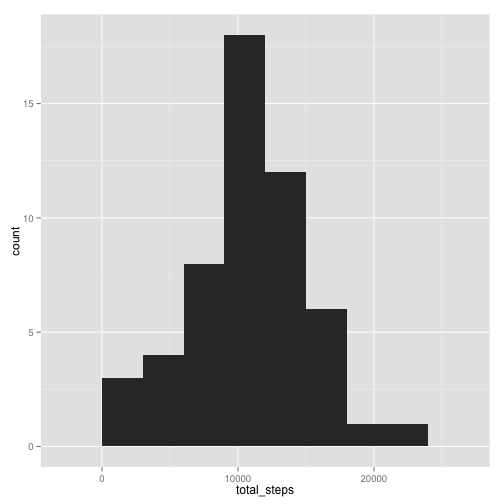
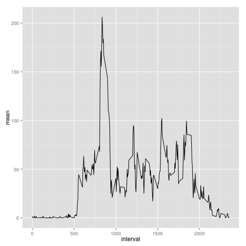
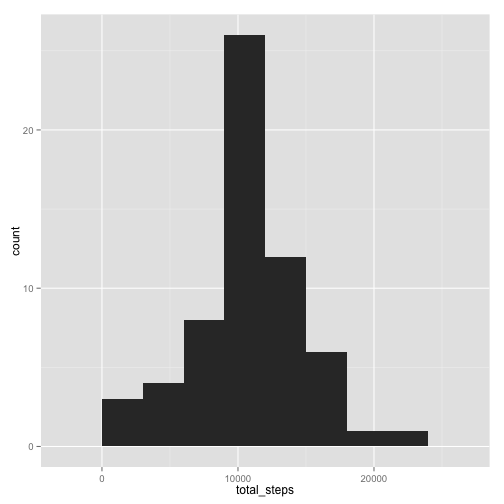
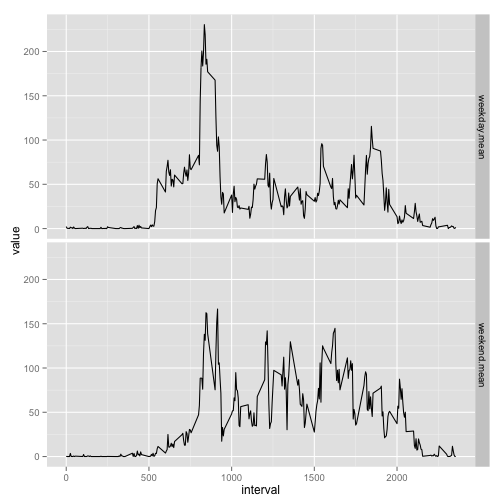

# Reproducible Research: Peer Assessment 1


## Loading and preprocessing the data

```r
unzip('activity.zip')
dt = read.csv('activity.csv')
dt$interval = as.numeric(dt$interval)
dt$date = as.Date(dt$date)
```


## What is mean total number of steps taken per day?

```r
require(plyr)
require(ggplot2)
require(reshape2)
cc <- dt[complete.cases(dt),]
daily <- ddply(cc,~date,summarise,total_steps=sum(steps)) 
```
###Histogram of the total number of steps taken each day ignoring missing values


```r
qplot(total_steps, data=daily, geom="histogram", binwidth=3000)
```

 

  
Mean total number of steps taken per day 10766.2  
Median total number of steps taken per day 10765


## What is the average daily activity pattern?

```r
iv <- ddply(cc, ~interval, summarise, mean=mean(steps)) 
qplot(interval, mean, data=iv, geom='line')
```

 

On average across all the days in the dataset, the maximum number of steps is in interval 835.


## Imputing missing values
In dataset there is 2304 missing values.
The mean of the known values on corresponding interval is used instead of missing values.


```r
ip <- dt[,]
ip <- join(ip, iv, by='interval')
ip$steps[is.na(ip$steps)] <- ip$mean[is.na(ip$steps)]
```
###Histogram of the total number of steps taken each day after imputing missing values

```r
daily <- ddply(ip,~date,summarise,total_steps=sum(steps)) 
qplot(total_steps, data=daily, geom="histogram", binwidth=3000)
```

 

Mean total number of steps taken per day is 10766.  
Median total number of steps taken per day is 10766.  
The histogram shows that the number of steps has increased while the distribution in respect to mean and median has not changed.

## Are there differences in activity patterns between weekdays and weekends?

```r
weekend <- ddply(ip[weekdays(ip$date)=="Saturday" | weekdays(ip$date)=="Sunday",],
                 ~interval,summarise,mean=mean(steps)) 
weekday <- ddply(ip[weekdays(ip$date)!="Saturday" & weekdays(ip$date)!="Sunday",],
                 ~interval,summarise,mean=mean(steps)) 
means <- data.frame(interval=weekday$interval, weekday$mean, weekend$mean)
means <- melt(means, id='interval')
ggplot(means, aes( x= interval, y= value)) + geom_line() + facet_grid(variable~.)
```

 
